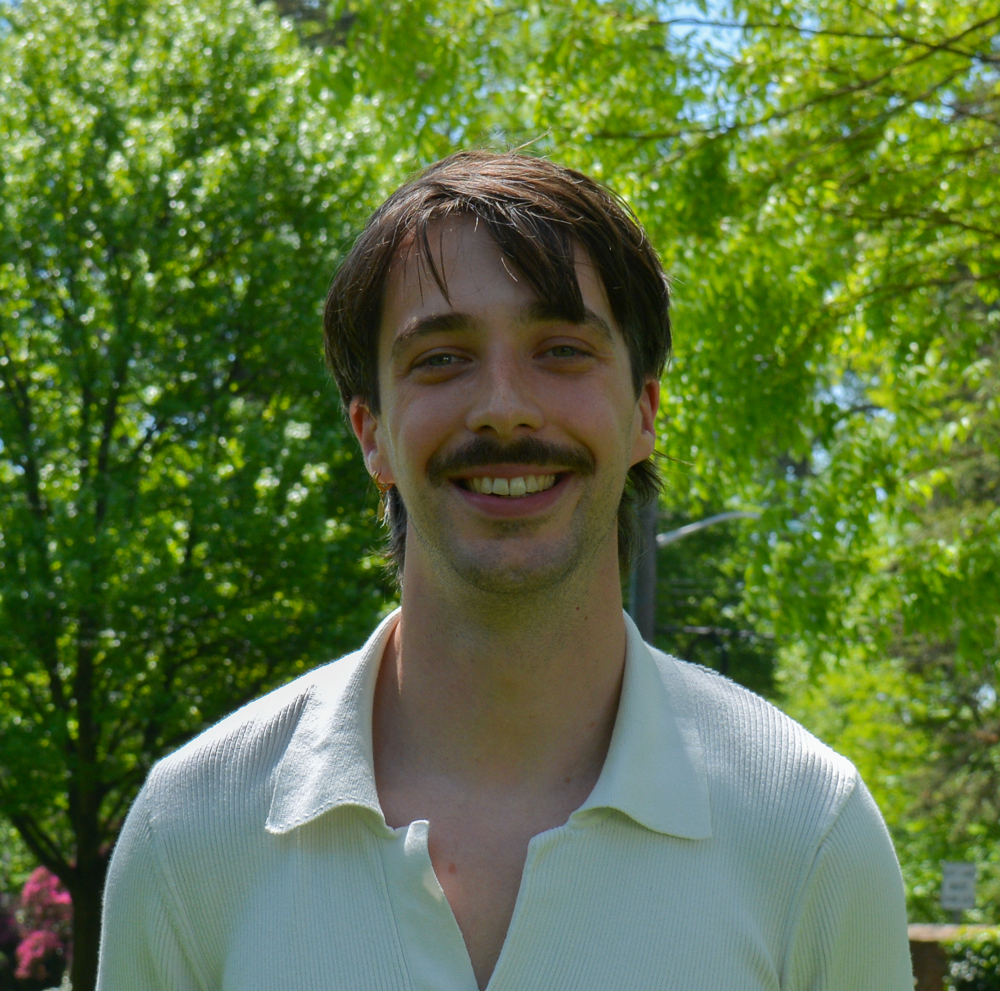

  

    
    <a href="https://drive.google.com/file/d/1Gekom_rW1KhPX_Iw3T6jO6h6VYKndLcB/view?usp=share_link" target="_blank">📄 CV</a>
    <a href="mailto:cherman@princeton.edu">✉️ cherman@princeton.edu</a>
    <a href="https://bsky.app/profile/clemherm.bsky.social" target="_blank">🌐 Bluesky</a>
  

  

    <h1>Clément Herman</h1>

    <h2>About me</h2>
    

      I am a Ph.D. candidate in Economics at Princeton University. I am a microeconomist with research interests in Behavioral Economics, Experimental Economics, and Political Economy.
    

    <h2>Research</h2>

  <h3><a href="https://drive.google.com/file/d/1y5wnjRmn4bTxqYAMbl-4sAGgy0OrtrPL/view?usp=share_link" target="_blank">How Do Groups Search? Experimental Evidencey</a></h3>
  <em>Working Paper, 2025 · Submitted</em> 
  <button onclick="toggleAbstract('abs1')">Abstract</button>
  

    
Searching for a suitable alternative—whether in research teams, hiring committees, or households—is often a collective process, combining the trade-offs of individual search with the challenges of group decision-making. We study collective search in laboratory experiments, where groups of participants sequentially sample alternatives. We vary the stopping-decision rule and the alignment of group members’ preferences, and compare group behavior to that of individuals under otherwise identical conditions. Several patterns emerge. While individuals tend to undersearch, groups examine more alternatives, particularly when unanimity is required to stop. When preferences are aligned, group search generates beneficial effects: participants raise their standards, and low-value alternatives are more likely to be rejected. When preferences are misaligned, however, group search generates detrimental effects: high-value alternatives are often rejected, and participants adopt lower standards. These findings reveal a new channel, the sequential exploration of alternatives, through which groups can outperform or underperform individual decision-making.

  

  <h3>Where to Search and When to Stop: A Lab Study</h3>
  
<strong>With:</strong> Alessandro Lizzeri, Leeat Yariv

  <em>In preparation</em>

  

