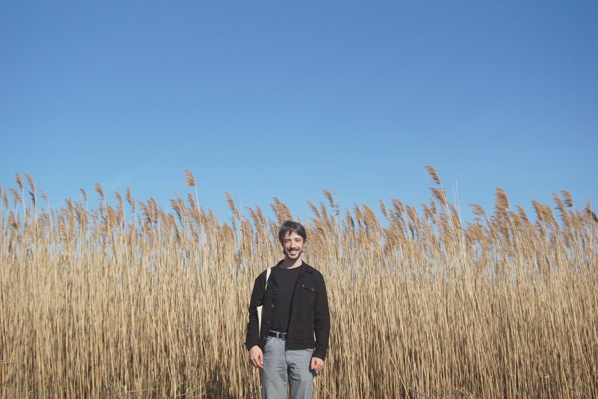

<table>
  <tr>
    <td style="width: 160px; vertical-align: top;">
      
    </td>
    <td style="padding-left: 20px;">
      <h1>Clément Herman</h1>
      
Doctoral Student in Economics Princeton University

      
Research interests: political economy, decision-making, behavioral economics.

      
<a href="https://drive.google.com/file/d/1Gekom_rW1KhPX_Iw3T6jO6h6VYKndLcB/view?usp=share_link" target="_blank">Download CV</a>

    </td>
  </tr>
</table>

---

## Research

### <a href="https://drive.google.com/file/d/1y5wnjRmn4bTxqYAMbl-4sAGgy0OrtrPL/view?usp=share_link" target="_blank">How Do Groups Search? An Experimental Study</a>  
<em>Working Paper, 2025 · Submitted</em>  
<button onclick="toggleAbstract('abs1')">Abstract</button>

  

    We study how group structure and preference alignment shape collective search behavior in sequential decision tasks.
    Groups perform better than individuals when preferences are aligned and stopping requires unanimity, but underperform in misaligned contexts. Our results disentangle behavioral and aggregation effects.
  

---

### Pandora 
<em>In preparation</em>  
<!-- Placeholder without link or abstract -->

---

### 
<em>In preparation</em>  
<!-- Placeholder without link or abstract -->

---

